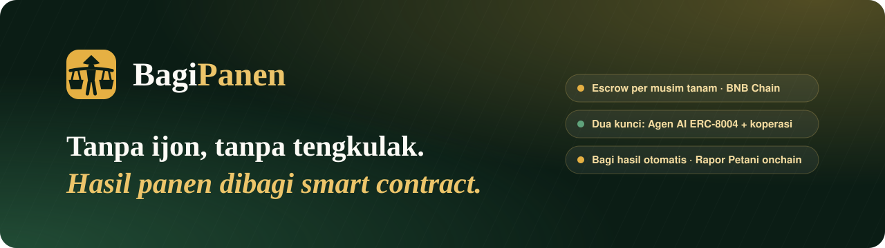
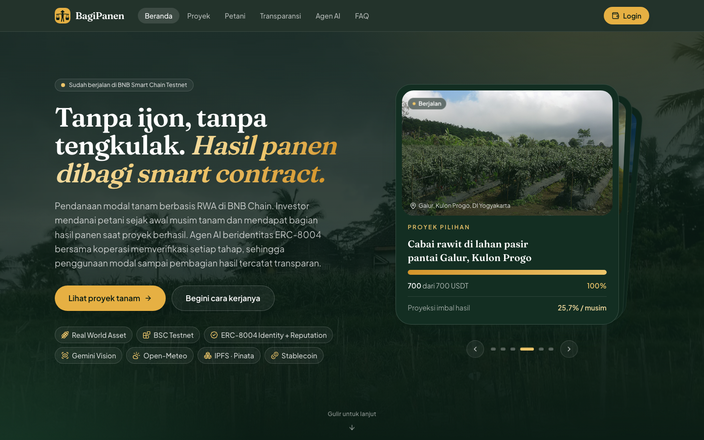
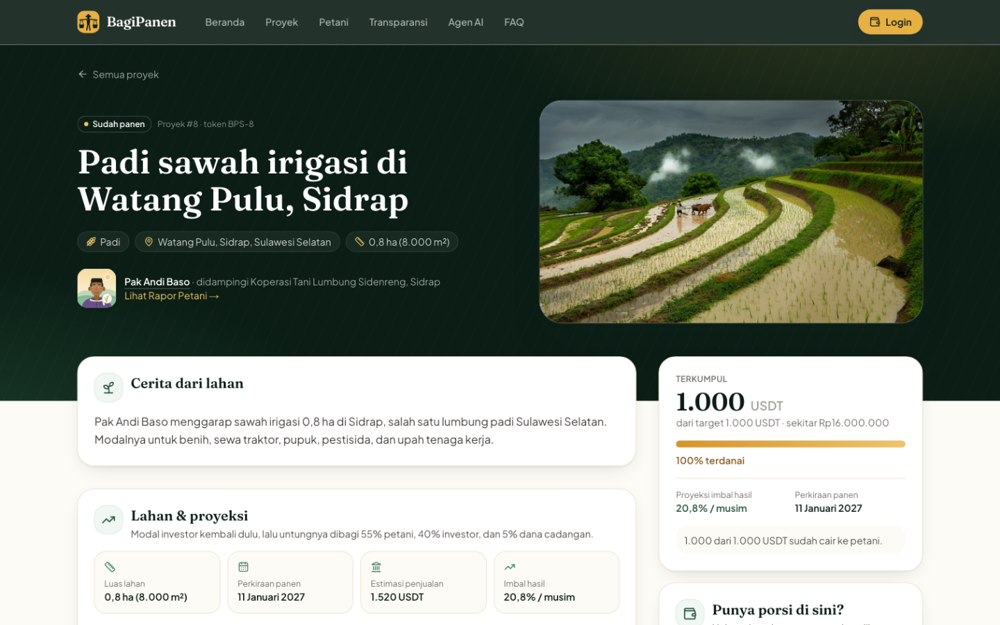
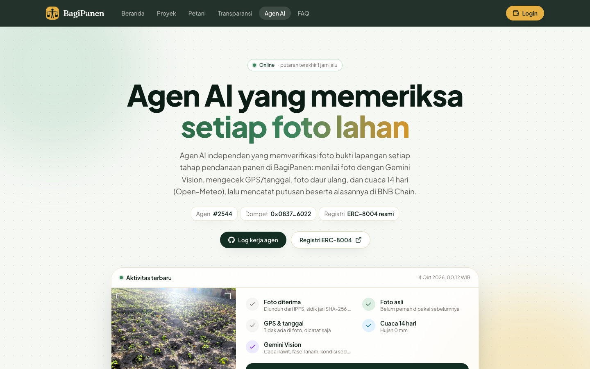
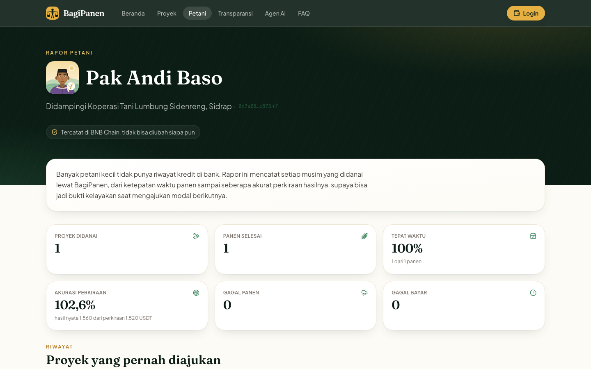
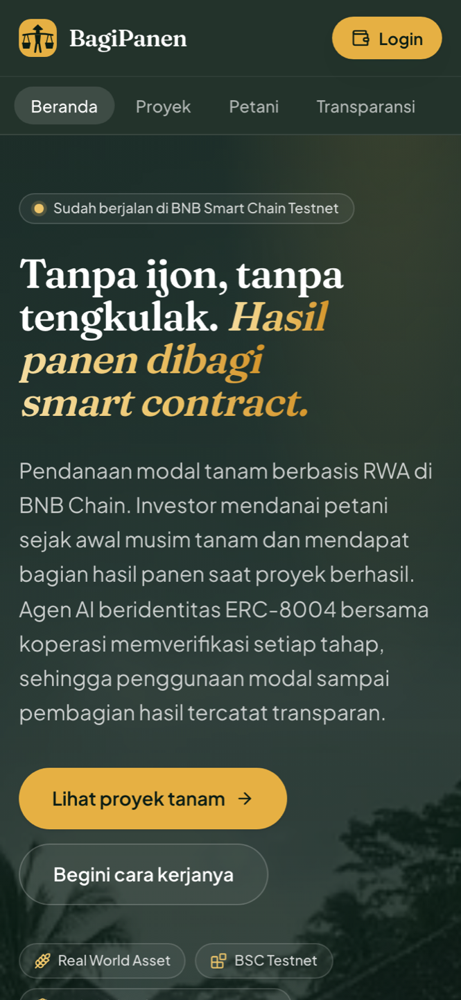
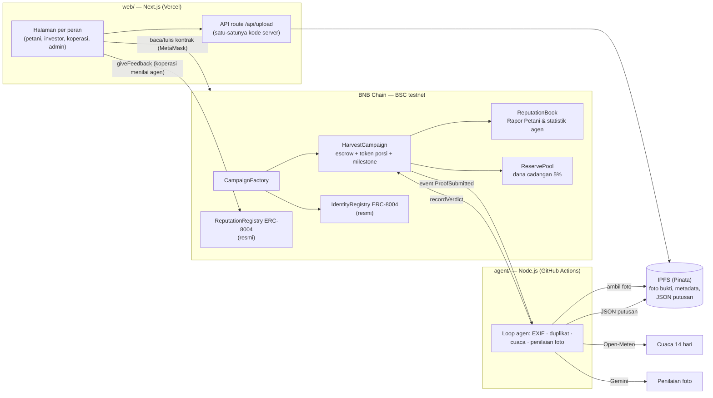

<div align="center">

<a href="https://bagipanen.vercel.app"></a>

<h3>Modal tanam yang adil untuk petani, transparan untuk investor, diverifikasi AI, tercatat onchain.</h3>

<p>
<a href="https://bagipanen.vercel.app"></a>
<a href="https://bagipanen.vercel.app/coba"></a>
<a href="https://testnet.bscscan.com/address/0xDaAAb760e8ba84dFBB209a1ec944875d71584809#code"></a>
<a href="https://testnet.bscscan.com/address/0x8004A818BFB912233c491871b3d84c89A494BD9e"></a>
</p>

<p>
<a href="https://github.com/MrPrinceAli/bagipanen/actions/workflows/agent.yml"></a>
<a href="LICENSE"></a>


<a href="CONTRIBUTING.md"></a>
</p>

<p>


</p>

<b><a href="https://bagipanen.vercel.app">Demo</a></b> ·
<a href="#-coba-sekarang-untuk-juri">Coba sekarang</a> ·
<a href="#-masalah--solusi">Masalah &amp; solusi</a> ·
<a href="#%EF%B8%8F-arsitektur">Arsitektur</a> ·
<a href="#-agen-ai-verifikator">Agen AI</a> ·
<a href="#alamat-kontrak">Kontrak</a> ·
<a href="#-menjalankan-di-lokal">Jalankan lokal</a>

<sub>🌾 Indonesia Web3 Hackathon 2026 · BNB Chain · Finance &amp; Commerce (RWA + stablecoin) · AI Agents · Consumer Apps</sub>

</div>

---

BagiPanen adalah platform pendanaan modal tanam untuk petani Indonesia di BNB Chain. Investor mendanai satu musim tanam dengan stablecoin. Dana cair bertahap setelah bukti lapangan diverifikasi **agen AI dan koperasi**, lalu hasil panen dibagi otomatis oleh smart contract.

> Indonesia Web3 Hackathon 2026 — track Finance & Commerce (RWA + stablecoin), AI Agents, dan Consumer Apps.
> **Status: berjalan di BSC testnet** — 5 kontrak terverifikasi di BscScan, agen AI terdaftar di registri ERC-8004 resmi (agen #2544) dan **berjalan otomatis di cloud** (GitHub Actions), 8 proyek contoh di 8 daerah mencakup semua status termasuk gagal pendanaan dan gagal panen.

| | |
| --- | --- |
| 🌐 **Demo web** | **[bagipanen.vercel.app](https://bagipanen.vercel.app)** (BSC testnet) |
| 🤖 **Agen AI** | [#2544 di IdentityRegistry ERC-8004](https://testnet.bscscan.com/address/0x8004A818BFB912233c491871b3d84c89A494BD9e) · halaman `/agent` di demo |
| 📜 **Kontrak** | [CampaignFactory di BscScan](https://testnet.bscscan.com/address/0xDaAAb760e8ba84dFBB209a1ec944875d71584809#code) · [daftar lengkap](#alamat-kontrak) |
| ⚙️ **Agen di cloud** | [GitHub Actions · Agen AI verifikator](https://github.com/MrPrinceAli/bagipanen/actions/workflows/agent.yml) (tiap ±5 menit, log publik) |
| ✅ **Hasil uji** | [docs/acceptance.md](docs/acceptance.md) (lokal & BSC testnet) |

<details>
<summary><b>English summary</b></summary>

BagiPanen is a crop-funding dApp on BNB Chain. Investors fund one growing season of a smallholder farmer with a stablecoin (MockUSDT on testnet). The money sits in a per-campaign escrow contract and is released in three tranches (planting 40%, growing 35%, pre-harvest 25%) only when **both** an AI agent and the farmer's cooperative approve a field photo. The AI agent has an on-chain identity in the official **ERC-8004 Identity Registry** (agent #2544), and cooperatives rate each of its verdicts in the official **ERC-8004 Reputation Registry**. It checks EXIF GPS/date, duplicate photos, 14-day weather (Open-Meteo), and asks **Gemini** to assess the photo. Each verdict is stored as JSON on IPFS (Pinata). After harvest, the contract repays investors' principal first, then splits profit 55% farmer / 40% investors / 5% reserve pool. Every season builds an on-chain **farmer report card** that can serve as an alternative credit history. The UI is in Indonesian. It is live on BSC testnet with all contracts verified; the AI agent runs autonomously in the cloud (GitHub Actions, every ~5 minutes), and eight demo projects across Indonesia cover every state, including failed funding (100% refund) and crop failure (reserve-pool compensation).
</details>

## 📸 Tampilan

<table>
<tr>
<td colspan="2"></td>
</tr>
<tr>
<td width="50%"><br><sub><b>Halaman proyek</b>: escrow, tahap cair, bagi hasil</sub></td>
<td width="50%"><br><sub><b>Agen AI #2544</b>: identitas ERC-8004 + putusan publik</sub></td>
</tr>
<tr>
<td width="50%"><br><sub><b>Rapor Petani</b>: riwayat kredit alternatif onchain</sub></td>
<td width="50%" align="center"><br><sub>Mobile-first</sub></td>
</tr>
</table>

## 🚀 Coba sekarang (untuk juri)

Yang dibutuhkan: MetaMask dan sedikit tBNB untuk gas. **Tidak ada uang sungguhan:** semua berjalan di BSC testnet dengan stablecoin demo (mUSDT).

> Panduan interaktif dengan centang otomatis per langkah: **[bagipanen.vercel.app/coba](https://bagipanen.vercel.app/coba)**.
>
> **Tanpa MetaMask?** Buka **[/masuk](https://bagipanen.vercel.app/masuk)** → *Coba tanpa dompet* dan pilih peran **Investor**, **Petani**, atau **Koperasi** (akun demo testnet), atau **Admin** (lihat saja). Alur yang bisa dicoba penuh: sebagai Petani kirim foto ke *Proyek demo juri #1* → agen AI di cloud menilainya ±1 menit → sebagai Koperasi konfirmasi sampai dana tahap cair. Kunci akun demo hanya ada di server (`/api/demo-tx` menandatangani transaksi ke kontrak BagiPanen saja); di BagiPanen sungguhan setiap orang masuk dengan dompetnya sendiri.

1. Buka **[bagipanen.vercel.app](https://bagipanen.vercel.app)**, klik **Hubungkan dompet**, lalu pilih MetaMask. Kalau diminta pindah jaringan, setujui pindah ke **BSC Testnet** (chain 97). Di HP, buka tautannya dari browser di dalam aplikasi MetaMask.
2. Ambil tBNB gratis dari [faucet QuickNode](https://faucet.quicknode.com/binance-smart-chain/bnb-testnet) atau [faucet BNB Chain](https://www.bnbchain.org/en/testnet-faucet). Faucet BNB Chain mensyaratkan saldo BNB mainnet. 0,005 tBNB sudah cukup untuk puluhan transaksi.
3. Klik **Minta mUSDT** di header untuk mendapat 1.000 mUSDT.
4. Pilih proyek berstatus **Cari dana** di beranda, misalnya **"Bawang merah musim kemarau di Rejoso, Nganjuk"** atau **"Kentang dataran tinggi di Berastagi, Karo"** (keduanya terbuka sampai 17 November 2026). Danai lewat dua langkah, *Izinkan mUSDT → Danai*. Token porsi (BPS) langsung muncul di dashboard.

Yang bisa dilihat tanpa wallet:

- **Proyek selesai** — [Padi Sidrap](https://bagipanen.vercel.app/campaign/0xd2cF6F942c33be09CEd219AC8413653935A52219) dan [Jagung Tanah Laut](https://bagipanen.vercel.app/campaign/0xE9F65054880f9b63c06736030c99f8D2FdE1722E): timeline tiga tahap dengan foto bukti dan alasan putusan Gemini, nota panen, bagi hasil, klaim investor, serta riwayat transaksi dengan tautan BscScan.
- **Gagal panen** — [Padi Demak](https://bagipanen.vercel.app/campaign/0x0f31dCAFb0770788a05CA2820D3Fe07B2690Eb47): tahap Tanam cair, lalu admin menandai gagal panen. Sisa dana 540 mUSDT + kompensasi dana cadangan 30 mUSDT dibagi ke investor sesuai porsi.
- **Gagal pendanaan** — [Kentang Dieng](https://bagipanen.vercel.app/campaign/0x2e67FB4A9349a73F5a82bcb5751ddf370f5891F9): target tidak tercapai sampai tenggat, investor refund 100%.
- **Rapor Petani:** klik nama petani di halaman proyek, misalnya [Pak Andi Baso](https://bagipanen.vercel.app/petani/0x7aE6ae33d47b40b9d7afd5DC23c98af3b40DcB73) (Sidrap) atau [Pak Kasmuri](https://bagipanen.vercel.app/petani/0x063B8Bb28af8183803b09Dd28a2c04cb8183DaD7) (Demak, tercatat gagal panen).
- **Agen AI** (`/agent`): identitas onchain, **reputasi di ERC-8004 ReputationRegistry** (persentase kesepakatan koperasi dengan putusan agen), isi agent card, statistik, dan 10 putusan terakhir. Log kerjanya di [GitHub Actions](https://github.com/MrPrinceAli/bagipanen/actions/workflows/agent.yml).
- **Penolakan oleh agen** (proyek uji coba awal di Garut, tidak tampil di beranda): [foto jagung ditolak Gemini lalu diunggah ulang](https://bagipanen.vercel.app/campaign/0xa13f0bB50045F5e8cA1054b9AeF070CD9D9c58bE) dan [foto yang sama dipakai ulang → ditolak sebagai duplikat](https://bagipanen.vercel.app/campaign/0xB0C1d27dd190d3d95327676f689E06D18930cb75).

Peran Petani, Koperasi, dan Admin terikat ke wallet demo kami. Alurnya ditunjukkan di video demo dan bisa dicoba penuh di [mode lokal](#-menjalankan-di-lokal) tanpa akun apa pun.

## 🌾 Masalah & solusi

Petani kecil sulit mendapat kredit bank karena tidak punya riwayat kredit, sehingga modal tanam datang dari tengkulak lewat sistem *ijon*: panen dibeli murah sebelum waktunya.

BagiPanen menguncinya di smart contract:

- **Dua kunci pencairan.** Dana tiap tahap (Tanam 40%, Tumbuh 35%, Pra-panen 25%) hanya cair jika agen AI **dan** koperasi sama-sama menyetujui foto bukti lapangan. Jika bukti gagal disetujui 3 kali, admin memutuskan sengketa, dan setiap putusan AI yang dibatalkan admin tercatat di rekam jejak agen.
- **Agen AI dengan identitas onchain.** Agen verifikator terdaftar di **registri identitas ERC-8004 resmi** di BSC testnet. Wallet-nya terpisah dari admin, koperasi, dan petani, dan semua putusannya publik.
- **Rapor Petani.** Setiap musim tercatat onchain sebagai riwayat kredit alternatif bagi petani yang tidak tercatat di SLIK OJK: jumlah panen, ketepatan waktu, akurasi estimasi, gagal panen, dan gagal bayar.
- **Bagi hasil otomatis.** Modal kembali ke investor dulu, lalu keuntungan dibagi **55% petani, 40% investor, 5% dana cadangan**. Admin tidak bisa menarik dana escrow.
- **Kondisi buruk ditangani.**
  - Pendanaan tidak tercapai → refund 100%.
  - Gagal panen → sisa escrow dan kompensasi dana cadangan dibagi pro-rata.
  - Gagal bayar → petani diblokir dan tercatat di rapornya.

Contoh dari data demo — modal 1.000 USDT, hasil penjualan 1.650 USDT. Angka ini sama persis dengan hasil di BSC testnet:

| Pos | USDT |
| --- | --- |
| Dana cair ke petani (400 + 350 + 250) | 1.000 |
| Keuntungan (1.650 − 1.000) | 650 |
| Bagian petani (55%) | 357,5 |
| Dana cadangan (5%) | 32,5 |
| Pool investor (modal + 40%) | 1.260 → Rina 630, Budi 378, Sari 252 (**imbal hasil 26%**) |

## 🏗️ Arsitektur

Tidak ada server aplikasi maupun database:
- smart contract menyimpan data dan dana;
- IPFS menyimpan foto, metadata, dan putusan;
- agen AI adalah satu-satunya proses off-chain yang aktif.



| Bagian | Teknologi |
| --- | --- |
| Kontrak | Solidity 0.8.24, Foundry, OpenZeppelin v5 |
| Web | Next.js 16 (App Router), React 19, Tailwind v4, wagmi v2, viem, RainbowKit |
| Agen | Node.js 20, TypeScript, viem, exifr, `@google/genai` (Gemini), Open-Meteo |
| Penyimpanan | IPFS via Pinata (testnet) / folder lokal (mode lokal) |

## 🤖 Agen AI verifikator

Agen memantau event `ProofSubmitted` dari semua proyek (polling 10 detik) dan menilai setiap bukti dalam 7 langkah:

1. ambil konteks dari kontrak (komoditas, lokasi, milestone, perkiraan panen);
2. unduh foto dari IPFS dan hitung SHA-256;
3. cek duplikat: foto yang sama di proyek atau milestone lain;
4. cek EXIF: GPS ≤ 2 km dari lahan, tanggal ≤ 7 hari sebelum bukti dikirim;
5. ambil cuaca 14 hari dari Open-Meteo;
6. nilai foto dengan **Gemini** (output JSON terstruktur: foto lahan?, komoditas, fase, kondisi, keyakinan, catatan);
7. unggah JSON putusan ke IPFS, lalu panggil `recordVerdict(ok, reasonCID)` di kontrak.

Foto disetujui hanya jika semua syarat ini terpenuhi:
- berupa foto lahan;
- komoditas dan fasenya cocok;
- keyakinan AI ≥ 0,70;
- EXIF tidak bertentangan;
- bukan duplikat.

Alasannya tampil dalam bahasa Indonesia di timeline proyek, antrean koperasi, dan halaman `/agent`.

**Identitas ERC-8004.**
- Agen terdaftar di IdentityRegistry resmi BSC testnet [`0x8004A818…BD9e`](https://testnet.bscscan.com/address/0x8004A818BFB912233c491871b3d84c89A494BD9e) sebagai **agen #2544**.
- Alamat registri dicek dari SDK resmi BNB Chain, repo kontrak ERC-8004, dan langsung di chain ([catatan riset](docs/erc8004-notes.md)).
- Agent card mengikuti format *registration file* ERC-8004 dan disimpan di IPFS.
- `CampaignFactory` hanya menerima putusan dari wallet yang memiliki NFT agen tersebut (`ownerOf(agentId) == agentWallet`).

**Ketahanan.**
- Ada model Gemini cadangan jika model utama sibuk (503) atau kuotanya habis (429), dengan batas waktu 45 detik per panggilan.
- Bukti yang gagal diproses dicoba ulang 3×, lalu masuk antrean tertunda dengan jeda bertahap.
- Agen idempoten: aman di-restart, dan bukti yang sudah diputus tidak dinilai dua kali.

## 📜 Smart contract

Semua kontrak ada di [contracts/src/](contracts/src/).

| Kontrak | Fungsi |
| --- | --- |
| `CampaignFactory` | Registri koperasi & petani, pembuat proyek, persetujuan admin, konfigurasi agen |
| `HarvestCampaign` | Satu per proyek: escrow mUSDT, token porsi 1:1 (tidak bisa dipindahtangankan), milestone dua kunci, sengketa, gagal panen, gagal bayar, bagi hasil, klaim kumulatif |
| `CampaignDeployer` | Memuat bytecode proyek agar factory tetap di bawah batas ukuran kontrak (EIP-170) |
| `ReservePool` | Dana cadangan 5%; kompensasi hanya bisa dikirim ke proyek resmi |
| `ReputationBook` | Rapor Petani dan statistik putusan agen, hanya bisa ditulis oleh proyek resmi |
| `MockUSDT` | Stablecoin demo (18 desimal, `mint` terbuka maks 10.000 per panggilan) |
| `MockAgentIdentity` | Fallback registri identitas agen untuk mode lokal (ERC-721 minimal) |

### Alamat kontrak

**BSC testnet (chain 97)** — semua terverifikasi di BscScan, blok deploy 134247179:

| Kontrak | Alamat |
| --- | --- |
| CampaignFactory | [`0xDaAAb760e8ba84dFBB209a1ec944875d71584809`](https://testnet.bscscan.com/address/0xDaAAb760e8ba84dFBB209a1ec944875d71584809#code) |
| MockUSDT (mUSDT) | [`0x09E5561C0d52eD66c8d65F2DA5c7EF4708555642`](https://testnet.bscscan.com/address/0x09E5561C0d52eD66c8d65F2DA5c7EF4708555642#code) |
| CampaignDeployer | [`0x41c4704112dd0089C218C8386F56beC21AD86FCe`](https://testnet.bscscan.com/address/0x41c4704112dd0089C218C8386F56beC21AD86FCe#code) |
| ReputationBook | [`0xE10414172fB887d9789AA2b33B6D062cb5432B90`](https://testnet.bscscan.com/address/0xE10414172fB887d9789AA2b33B6D062cb5432B90#code) |
| ReservePool | [`0x9e4C939F7DD58b13cBB1148bff4fC15433E0978b`](https://testnet.bscscan.com/address/0x9e4C939F7DD58b13cBB1148bff4fC15433E0978b#code) |
| IdentityRegistry ERC-8004 (resmi, bukan milik BagiPanen) | [`0x8004A818BFB912233c491871b3d84c89A494BD9e`](https://testnet.bscscan.com/address/0x8004A818BFB912233c491871b3d84c89A494BD9e) |
| ReputationRegistry ERC-8004 (resmi, bukan milik BagiPanen) | [`0x8004B663056A597Dffe9eCcC1965A193B7388713`](https://testnet.bscscan.com/address/0x8004B663056A597Dffe9eCcC1965A193B7388713) |
| Wallet agen AI (#2544) | [`0x0837FE45C0faf7a101C98d70D71476db81806022`](https://testnet.bscscan.com/address/0x0837FE45C0faf7a101C98d70D71476db81806022) |

Proyek demo di testnet (dibuat dengan [`agent/scripts/seed-showcase.ts`](agent/scripts/seed-showcase.ts) lewat transaksi sungguhan; foto bukti dinilai agen AI, bukan diisi manual). Tiga proyek uji coba awal di Garut tidak tampil di beranda, tetapi tetap bisa dibuka lewat tautan.

| Proyek | Komoditas · lokasi | Status | Isi |
| --- | --- | --- | --- |
| [`0xd880…01EC`](https://testnet.bscscan.com/address/0xd880139c524932250a89F37b05E5f1607fd901EC) | Bawang merah · Rejoso, Nganjuk, Jawa Timur | Cari dana (sampai 17 Nov 2026) | 60% terkumpul, terbuka untuk dicoba juri |
| [`0x6E55…cB8B`](https://testnet.bscscan.com/address/0x6E55404560B82Eec9548AE645382AB93280fcB8B) | Kentang · Berastagi, Karo, Sumatera Utara | Cari dana (sampai 17 Nov 2026) | 25% terkumpul, terbuka untuk dicoba juri |
| [`0x442e…1BDC`](https://testnet.bscscan.com/address/0x442ea9D7ffbDf16FE0f2bd1f62F25555C43D1BDC) | Cabai rawit · Galur, Kulon Progo, DIY | Berjalan | Bukti Tanam disetujui agen ±43 detik setelah dikirim (dipicu `/api/agent-wake`), menunggu konfirmasi koperasi |
| [`0x04Be…97CD`](https://testnet.bscscan.com/address/0x04Be743A5271De7132859bEAd9fCf2a0F58597CD) | Padi · Praya, Lombok Tengah, NTB | Berjalan | Tahap Tanam cair (disetujui Gemini + koperasi) |
| [`0xd2cF…2219`](https://testnet.bscscan.com/address/0xd2cF6F942c33be09CEd219AC8413653935A52219) | Padi · Watang Pulu, Sidrap, Sulawesi Selatan | Selesai | 3 tahap cair → setor panen 1.560 → klaim 612/367,2/244,8 |
| [`0xE9F6…722E`](https://testnet.bscscan.com/address/0xE9F65054880f9b63c06736030c99f8D2FdE1722E) | Jagung · Pelaihari, Tanah Laut, Kalimantan Selatan | Selesai | 3 tahap cair → setor panen 1.700, siap diklaim |
| [`0x0f31…Eb47`](https://testnet.bscscan.com/address/0x0f31dCAFb0770788a05CA2820D3Fe07B2690Eb47) | Padi · Karanganyar, Demak, Jawa Tengah | Gagal panen | Tanam cair → gagal panen → sisa 540 + kompensasi cadangan 30 → klaim |
| [`0x2e67…91F9`](https://testnet.bscscan.com/address/0x2e67FB4A9349a73F5a82bcb5751ddf370f5891F9) | Kentang · Kejajar, Wonosobo, Jawa Tengah | Gagal pendanaan | 25% terkumpul saat tenggat → refund 100% |
| [`0xa13f…58bE`](https://testnet.bscscan.com/address/0xa13f0bB50045F5e8cA1054b9AeF070CD9D9c58bE) | Cabai merah · Cikajang, Garut (uji coba awal) | Selesai | Foto jagung ditolak Gemini → unggah ulang → 3 tahap cair → klaim 630/378/252 |
| [`0xB0C1…cb75`](https://testnet.bscscan.com/address/0xB0C1d27dd190d3d95327676f689E06D18930cb75) | Cabai merah · Garut (uji coba awal) | Berjalan | Foto bukti yang sama dipakai ulang → ditolak sebagai duplikat |
| [`0xff66…74b9`](https://testnet.bscscan.com/address/0xff66E4Ce4f4cD4e98619dE0524390c3581Eb74b9) | Cabai merah · Garut (uji coba awal) | Cari dana (sampai 15 Okt 2026) | — |

**Anvil (lokal, chain 31337)** — alamatnya selalu sama setiap `npm run dev:chain`, karena deploy dari akun bawaan Anvil pada nonce yang sama: factory `0x9fE46736679d2D9a65F0992F2272dE9f3c7fa6e0`, mUSDT `0x5FbDB2315678afecb367f032d93F642f64180aa3`, MockAgentIdentity `0xe7f1725E7734CE288F8367e1Bb143E90bb3F0512`. Daftar lengkapnya ada di [deployments/anvil.json](deployments/anvil.json).

## 💻 Menjalankan di lokal

Mode lokal tidak butuh akun, API key, maupun MetaMask. Chain, penyimpanan file, dan penilai foto semuanya berjalan di laptop.

**Prasyarat:** Node.js 20+, Git, dan [Foundry](https://book.getfoundry.sh/getting-started/installation) (`forge`, `anvil`, `cast`).

```bash
git clone https://github.com/MrPrinceAli/bagipanen.git && cd bagipanen
git submodule update --init --depth 1     # library Foundry (forge-std, OpenZeppelin)
(cd web && npm install) && (cd agent && npm install)
```

Pastikan `APP_MODE=local` di `agent/.env` dan `NEXT_PUBLIC_APP_MODE=local` di `web/.env.local`. Jika file belum ada, salin bagiannya dari [.env.example](.env.example). Lalu jalankan di tiga terminal:

```bash
npm run dev:chain   # 1. Anvil + deploy + data demo + daftarkan agen AI (biarkan jalan)
npm run dev:web     # 2. web di http://localhost:3000
npm run dev:agent   # 3. agen AI (log: [BUKTI] → [AI] → [PUTUSAN])
```

Pilih peran lewat **pemilih akun demo** di header. Setiap akun adalah akun bawaan Anvil:
- Admin;
- Koperasi (Koperasi Tani Makmur, Garut);
- Petani (Pak Darto);
- investor Rina, Budi, dan Sari, masing-masing dengan 5.000 mUSDT.

### Skenario demo

1. **Petani → Ajukan.** Klik *Isi contoh data demo*, lalu pilih foto lahan. Koordinat terisi otomatis dari GPS foto, atau memakai koordinat contoh kalau fotonya tidak punya GPS. Klik *Ajukan proyek tanam*.
2. **Admin → Admin.** Klik *Setujui & buka pendanaan*. Hitung mundur pendanaan 10 menit dimulai.
3. **Rina, Budi, Sari** buka halaman proyek dan danai 500, 300, dan 200 lewat *Izinkan mUSDT → Danai*. Begitu target tercapai, statusnya berubah menjadi **Berjalan**.
4. **Petani** mengirim bukti tahap Tanam berupa foto yang salah. Agen menolaknya dalam ±10 detik dan menjelaskan alasannya. **Koperasi → Koperasi** ikut memutuskan dari antrean. Petani lalu mengirim ulang foto yang benar. Setelah agen dan koperasi setuju, 400 USDT cair.
5. Ulangi untuk **Tumbuh** (350) dan **Pra-panen** (250).
6. **Petani** setor hasil panen 1.650 beserta foto nota (*Unggah nota → Izinkan mUSDT → Setor*). Bagian petani 357,5 dan dana cadangan 32,5 langsung terkirim.
7. **Rina, Budi, Sari** klaim 630, 378, dan 252. Lihat juga **Rapor Petani** (klik nama petani) dan **Agen AI**.

Foto contoh berlisensi bebas ada di [docs/demo-photos/](docs/demo-photos/), beserta sumber dan lisensinya. Di mode lokal, penilai foto adalah `MockVision`: ia menyetujui foto, kecuali nama filenya mengandung `salah` atau `tolak`, misalnya `foto-salah-jagung.jpg`. Pemeriksaan EXIF, duplikat, dan cuaca tetap berjalan sungguhan.

Menjalankan ulang `npm run dev:chain` memulai chain dari nol, dan agen mendeteksinya otomatis.

## ⛓️ Menjalankan di BSC testnet

Kode yang sama berjalan di BSC testnet cukup dengan mengganti `.env`. Adapter yang dipakai otomatis beralih:

| Komponen | `APP_MODE=local` | `APP_MODE=testnet` |
| --- | --- | --- |
| Jaringan | Anvil (31337) | BSC testnet (97) |
| Wallet | Pemilih akun demo | MetaMask via RainbowKit |
| Penyimpanan | Folder `web/.local-ipfs/` | IPFS via Pinata |
| Penilai foto | MockVision | Gemini |
| Identitas agen | MockAgentIdentity | IdentityRegistry ERC-8004 resmi |

Semua layanan memakai paket gratis. Daftar variabelnya ada di [.env.example](.env.example):
- Pinata JWT untuk unggah file;
- Gemini API key dari Google AI Studio;
- Etherscan API key (V2) untuk verifikasi kontrak.

1. **Deploy kontrak.** Isi `contracts/.env`: `DEPLOYER_PRIVATE_KEY`, `BSC_TESTNET_RPC`, `BSCSCAN_API_KEY`, dan `ERC8004_IDENTITY_REGISTRY`. Lalu jalankan:
   ```bash
   npm run deploy:testnet   # deploy + verifikasi BscScan + sync ABI & alamat ke web/ dan agent/
   npm run seed:testnet     # opsional: tBNB & mUSDT ke akun demo, daftarkan koperasi & petani
   ```
2. **Daftarkan agen.** Isi `agent/.env`, lalu jalankan `cd agent && npm run register`. Perintah ini mendaftar di registri ERC-8004 dan mengunggah agent card ke Pinata. Setelah itu admin memanggil `setAgent` di halaman `/admin` (bagian *Konfigurasi agen AI*) dengan parameter yang dicetak.
3. **Jalankan agen:** di cloud lewat GitHub Actions (lihat [Agen di cloud](#agen-di-cloud-github-actions)), atau di laptop dengan `npm run dev:agent` untuk respons paling cepat. Jangan jalankan keduanya bersamaan.
4. **Web:** isi `web/.env.local` (`NEXT_PUBLIC_APP_MODE=testnet`, `PINATA_JWT`, `NEXT_PUBLIC_IPFS_GATEWAY`, `NEXT_PUBLIC_BSC_TESTNET_RPC`), lalu `npm run dev:web` atau deploy ke Vercel.

### Deploy ke Vercel

- Root directory: `web/` (framework Next.js terdeteksi otomatis).
- Environment variable: `NEXT_PUBLIC_APP_MODE=testnet`, `PINATA_JWT` (rahasia, hanya dipakai API route di server), `NEXT_PUBLIC_IPFS_GATEWAY`, `NEXT_PUBLIC_BSC_TESTNET_RPC=https://bsc-testnet-rpc.publicnode.com`, `NEXT_PUBLIC_BSC_TESTNET_LOGS_RPC=https://rpc.sentio.xyz/bsc-testnet` (publicnode hanya menyimpan log beberapa hari terakhir; tanpa ini riwayat lama seperti pendaftaran koperasi tidak terbaca), `NEXT_PUBLIC_IDR_PER_USDT=16000`.
- Alamat kontrak tidak perlu diisi, karena sudah ada di `web/lib/deployments.ts` hasil `npm run sync`. Variabel `NEXT_PUBLIC_*_ADDRESS` hanya untuk menimpa alamat itu.
- Agen AI tidak di-deploy ke Vercel (fungsi Vercel hanya hidup saat ada permintaan). Agen berjalan di GitHub Actions, lihat bagian berikut.

### Agen di cloud (GitHub Actions)

[`.github/workflows/agent.yml`](.github/workflows/agent.yml) membangunkan agen setiap ±5 menit untuk **satu putaran** (`npm start -- --once`): membaca bukti baru di chain, menilainya, mencatat putusan, lalu berhenti. Gratis untuk repo publik dan tidak bergantung pada laptop siapa pun.

- **State antar-run** (blok terakhir, sidik jari foto, antrean ulang) disimpan dengan cache Actions. Kalau cache kosong, agen memulihkan sidik jari foto lama langsung dari chain + IPFS tanpa memanggil Gemini, jadi deteksi foto daur ulang tetap jalan.
- **Secrets** (Settings → Secrets and variables → Actions): `AGENT_PRIVATE_KEY`, `GEMINI_API_KEY`, `PINATA_JWT`, `IPFS_GATEWAY`, `BSC_TESTNET_RPC`. Model bisa diatur lewat *variables* `GEMINI_MODEL` dan `GEMINI_FALLBACK_MODELS`.
- Log Actions bersifat publik, jadi agen hanya mencetak host RPC, bukan URL lengkapnya. Nilai secrets juga otomatis disensor GitHub.
- Bisa dipicu manual dari tab **Actions → Agen AI verifikator → Run workflow**.
- **Langsung saat foto dikirim (opsional):** isi `GITHUB_DISPATCH_TOKEN` di environment variable Vercel (fine-grained token, repo ini saja, izin *Actions: Read and write*). Setelah petani mengirim foto, web memanggil `/api/agent-wake`, yang memicu workflow hanya jika kontrak resmi itu benar-benar punya bukti yang menunggu putusan dan agen belum berjalan. Putusan jadi keluar ±1–3 menit, bukan 5–15 menit.

## 🧪 Test

```bash
npm run test:contracts   # 90 test Foundry, cakupan 100% baris/cabang/fungsi, termasuk fuzz pembulatan
npm run test:agent       # 47 unit test agen (aturan putusan, EXIF, MockVision, model cadangan Gemini, cuaca, duplikat, antrean)
(cd web && npm run lint && npm run build)
```

Test Foundry mencakup semua skenario wajib PRD:

- happy path dengan angka di atas;
- pendanaan gagal → refund;
- ditolak AI → unggah ulang;
- sengketa;
- panen di bawah modal;
- gagal panen + kompensasi kumulatif;
- gagal bayar → petani diblokir;
- kontrol akses;
- fuzz pembulatan.

Hasil uji acceptance per butir PRD, di lokal dan BSC testnet, ada di [docs/acceptance.md](docs/acceptance.md).

## 📝 Catatan jujur

- **Agen AI berjalan di GitHub Actions setiap ±5 menit**, bukan terus-menerus. Jadwal GitHub kadang terlambat beberapa menit, jadi putusan bisa datang 5–15 menit setelah foto dikirim; selama itu bukti berstatus "Bukti dikirim" dan koperasi tetap bisa memutuskan lebih dulu. Untuk demo langsung, agen yang sama bisa dijalankan di laptop (`npm run dev:agent`) dengan jeda ±10 detik.
- **Latensi putusan di testnet ±30–50 detik** (target PRD ≤ 30 detik tercapai di mode lokal). Penyebab utamanya Gemini paket gratis: model utama sering sibuk (503) atau kuota hariannya habis (429), sehingga agen pindah ke model cadangan. Rinciannya ada di [docs/acceptance.md](docs/acceptance.md#bsc-testnet-gelombang-8).
- **Foto demo diambil dari Wikimedia Commons** (berlisensi CC, sumbernya dicatat). Foto ini bukan foto lapangan asli dan tidak punya EXIF. Agen mencatat "EXIF tidak ada" tanpa menolak, sesuai aturan PRD. Data EXIF tidak pernah dipalsukan.
- **mUSDT adalah token demo** yang bisa di-mint siapa saja (maks 10.000 per panggilan). Admin memakai satu wallet (multisig ada di roadmap).
- Unggah foto di versi Vercel dibatasi ±4,5 MB oleh platform. Batas aplikasi 5 MB berlaku di mode lokal.
- Semua keputusan teknis dan alasannya dicatat di [docs/decisions.md](docs/decisions.md).

## 🗂️ Struktur repo

```text
contracts/   Foundry: src/ (kontrak), test/, script/ (Deploy, Seed, SeedTestnet)
web/         Next.js App Router + Tailwind + wagmi v2 + RainbowKit (root directory Vercel)
agent/       Agen AI Node.js (viem, exifr, @google/genai), agent-card.json
deployments/ Alamat kontrak hasil deploy (anvil.json, bscTestnet.json)
scripts/     dev-chain.mjs (satu perintah chain lokal), sync.mjs (salin ABI & alamat)
docs/        PRD, keputusan teknis, hasil uji, riset ERC-8004, foto demo
```

## 🔭 Di luar lingkup MVP

Login sosial & gasless, BNB Greenfield, pasar sekunder token porsi, pembayaran x402, notifikasi WhatsApp/Telegram, mainnet, multisig admin, penilaian agen oleh admin saat sengketa, dan Validation Registry ERC-8004. Roadmap lengkapnya ada di [docs/PRD.md](docs/PRD.md).

## 🤝 Kontribusi & lisensi

Kontribusi terbuka, lihat [CONTRIBUTING.md](CONTRIBUTING.md). Laporan keamanan lewat [SECURITY.md](SECURITY.md).
Foto demo berasal dari Wikimedia Commons; sumber dan lisensinya tercatat di [docs/demo-photos/SUMBER.md](docs/demo-photos/SUMBER.md).

Kode dirilis di bawah lisensi [MIT](LICENSE) © 2026 MrPrinceAli dan kontributor BagiPanen.

<div align="center"><sub>Dibuat dengan 💛 untuk petani Indonesia · <a href="https://bagipanen.vercel.app">bagipanen.vercel.app</a></sub></div>
