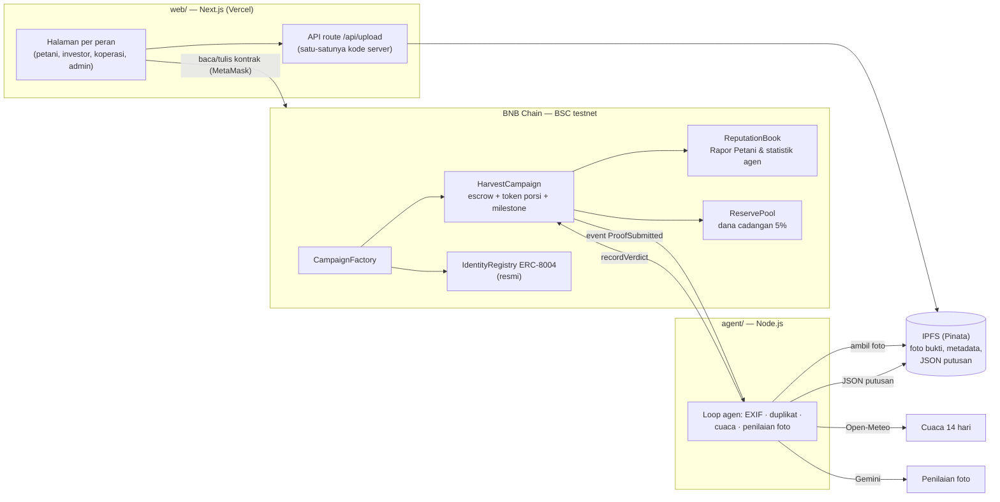

# BagiPanen

**Modal tanam yang adil untuk petani, transparan untuk investor, diverifikasi AI, tercatat onchain.**

BagiPanen adalah platform pendanaan modal tanam untuk petani Indonesia di BNB Chain. Investor mendanai satu musim tanam dengan stablecoin. Dana cair bertahap setelah bukti lapangan diverifikasi **agen AI dan koperasi**, lalu hasil panen dibagi otomatis oleh smart contract.

> Indonesia Web3 Hackathon 2026 — track Finance & Commerce (RWA + stablecoin), AI Agents, dan Consumer Apps.
> **Status: berjalan di BSC testnet** — 5 kontrak terverifikasi di BscScan, agen AI terdaftar di registri ERC-8004 resmi (agen #2544), skenario penuh sudah diuji dari pengajuan sampai semua investor klaim.

| | |
| --- | --- |
| 🌐 **Demo web** | **[bagipanen.vercel.app](https://bagipanen.vercel.app)** (BSC testnet) |
| 🤖 **Agen AI** | [#2544 di IdentityRegistry ERC-8004](https://testnet.bscscan.com/address/0x8004A818BFB912233c491871b3d84c89A494BD9e) · halaman `/agent` di demo |
| 📜 **Kontrak** | [CampaignFactory di BscScan](https://testnet.bscscan.com/address/0xDaAAb760e8ba84dFBB209a1ec944875d71584809#code) · [daftar lengkap](#alamat-kontrak) |
| ✅ **Hasil uji** | [docs/acceptance.md](docs/acceptance.md) (lokal & BSC testnet) |

<details>
<summary><b>English summary</b></summary>

BagiPanen is a crop-funding dApp on BNB Chain. Investors fund one growing season of a smallholder farmer with a stablecoin (MockUSDT on testnet). The money sits in a per-campaign escrow contract and is released in three tranches (planting 40%, growing 35%, pre-harvest 25%) only when **both** an AI agent and the farmer's cooperative approve a field photo. The AI agent has an on-chain identity in the official **ERC-8004 Identity Registry** (agent #2544) and a public verdict record. It checks EXIF GPS/date, duplicate photos, 14-day weather (Open-Meteo), and asks **Gemini** to assess the photo. Each verdict is stored as JSON on IPFS (Pinata). After harvest, the contract repays investors' principal first, then splits profit 55% farmer / 40% investors / 5% reserve pool. Every season builds an on-chain **farmer report card** that can serve as an alternative credit history. The UI is in Indonesian. It is live on BSC testnet with all contracts verified, and the full scenario has been tested end to end.
</details>

## Coba sekarang (untuk juri)

Yang dibutuhkan: MetaMask dan sedikit tBNB untuk gas. **Tidak ada uang sungguhan:** semua berjalan di BSC testnet dengan stablecoin demo (mUSDT).

1. Buka **[bagipanen.vercel.app](https://bagipanen.vercel.app)**, klik **Hubungkan Dompet**, dan pilih MetaMask. Jika diminta, setujui pindah ke jaringan **BSC Testnet** (chain 97). Di HP, buka link dari browser di dalam aplikasi MetaMask.
2. Ambil tBNB gratis dari [faucet QuickNode](https://faucet.quicknode.com/binance-smart-chain/bnb-testnet) atau [faucet BNB Chain](https://www.bnbchain.org/en/testnet-faucet). Faucet BNB Chain mensyaratkan saldo BNB mainnet. 0,005 tBNB sudah cukup untuk puluhan transaksi.
3. Klik **Minta mUSDT demo** di header. Wallet Anda mendapat 1.000 mUSDT.
4. Buka kampanye **"Modal tanam cabai merah musim kemarau 2027"** (pendanaan terbuka sampai 15 Oktober 2026). Danai lewat dua langkah, *Setujui mUSDT → Danai*. Token porsi (BPS) akan tercatat di dashboard Anda.

Yang bisa dilihat tanpa wallet:

- **Kampanye yang sudah selesai** — "Modal tanam cabai merah musim hujan 2026":
  - timeline milestone dengan foto bukti;
  - putusan Gemini (termasuk foto jagung yang **ditolak**);
  - nota panen, bagi hasil, dan riwayat transaksi lengkap dengan tautan BscScan.
- **Rapor Petani:** klik nama petani "Pak Darto".
- **Agen AI** (`/agent`): identitas onchain, isi agent card, statistik, dan 10 putusan terakhir.
- **Kampanye kedua** "Perluasan lahan cabai merah 0,3 ha": foto bukti yang sama diunggah ulang, lalu **ditolak sebagai duplikat**.

Peran Petani, Koperasi, dan Admin terikat ke wallet demo kami. Alurnya ditunjukkan di video demo dan bisa dicoba penuh di [mode lokal](#menjalankan-di-lokal) tanpa akun apa pun.

## Masalah & solusi

Petani kecil sulit mendapat kredit bank karena tidak punya riwayat kredit, sehingga modal tanam datang dari tengkulak lewat sistem *ijon*: panen dibeli murah sebelum waktunya.

BagiPanen menguncinya di smart contract:

- **Dua kunci pencairan.** Dana tiap tahap (Tanam 40%, Tumbuh 35%, Pra-panen 25%) hanya cair jika agen AI **dan** koperasi sama-sama menyetujui foto bukti lapangan. Jika bukti gagal disetujui 3 kali, admin memutuskan sengketa, dan setiap putusan AI yang dibatalkan admin tercatat di rekam jejak agen.
- **Agen AI dengan identitas onchain.** Agen verifikator terdaftar di **registri identitas ERC-8004 resmi** di BSC testnet. Wallet-nya terpisah dari admin, koperasi, dan petani, dan semua putusannya publik.
- **Rapor Petani.** Setiap musim tercatat onchain sebagai riwayat kredit alternatif bagi petani yang tidak tercatat di SLIK OJK: jumlah panen, ketepatan waktu, akurasi estimasi, gagal panen, dan gagal bayar.
- **Bagi hasil otomatis.** Modal kembali ke investor dulu, lalu keuntungan dibagi **55% petani, 40% investor, 5% dana cadangan**. Admin tidak bisa menarik dana escrow.
- **Kondisi buruk ditangani.**
  - Pendanaan tidak tercapai → refund 100%.
  - Gagal panen → sisa escrow dan kompensasi dana cadangan dibagi pro-rata.
  - Gagal bayar → petani diblokir dan tercatat di rapornya.

Contoh dari data demo — modal 1.000 USDT, hasil penjualan 1.650 USDT. Angka ini sama persis dengan hasil di BSC testnet:

| Pos | USDT |
| --- | --- |
| Dana cair ke petani (400 + 350 + 250) | 1.000 |
| Keuntungan (1.650 − 1.000) | 650 |
| Bagian petani (55%) | 357,5 |
| Dana cadangan (5%) | 32,5 |
| Pool investor (modal + 40%) | 1.260 → Rina 630, Budi 378, Sari 252 (**imbal hasil 26%**) |

## Arsitektur

Tidak ada server aplikasi maupun database:
- smart contract menyimpan data dan dana;
- IPFS menyimpan foto, metadata, dan putusan;
- agen AI adalah satu-satunya proses off-chain yang aktif.



| Bagian | Teknologi |
| --- | --- |
| Kontrak | Solidity 0.8.24, Foundry, OpenZeppelin v5 |
| Web | Next.js 16 (App Router), React 19, Tailwind v4, wagmi v2, viem, RainbowKit |
| Agen | Node.js 20, TypeScript, viem, exifr, `@google/genai` (Gemini), Open-Meteo |
| Penyimpanan | IPFS via Pinata (testnet) / folder lokal (mode lokal) |

## Agen AI verifikator

Agen memantau event `ProofSubmitted` dari semua kampanye (polling 10 detik) dan menilai setiap bukti dalam 7 langkah:

1. ambil konteks dari kontrak (komoditas, lokasi, milestone, perkiraan panen);
2. unduh foto dari IPFS dan hitung SHA-256;
3. cek duplikat: foto yang sama di kampanye atau milestone lain;
4. cek EXIF: GPS ≤ 2 km dari lahan, tanggal ≤ 7 hari sebelum bukti dikirim;
5. ambil cuaca 14 hari dari Open-Meteo;
6. nilai foto dengan **Gemini** (output JSON terstruktur: foto lahan?, komoditas, fase, kondisi, keyakinan, catatan);
7. unggah JSON putusan ke IPFS, lalu panggil `recordVerdict(ok, reasonCID)` di kontrak.

Foto disetujui hanya jika semua syarat ini terpenuhi:
- berupa foto lahan;
- komoditas dan fasenya cocok;
- keyakinan AI ≥ 0,70;
- EXIF tidak bertentangan;
- bukan duplikat.

Alasannya tampil dalam bahasa Indonesia di timeline kampanye, antrean koperasi, dan halaman `/agent`.

**Identitas ERC-8004.**
- Agen terdaftar di IdentityRegistry resmi BSC testnet [`0x8004A818…BD9e`](https://testnet.bscscan.com/address/0x8004A818BFB912233c491871b3d84c89A494BD9e) sebagai **agen #2544**.
- Alamat registri dicek dari SDK resmi BNB Chain, repo kontrak ERC-8004, dan langsung di chain ([catatan riset](docs/erc8004-notes.md)).
- Agent card mengikuti format *registration file* ERC-8004 dan disimpan di IPFS.
- `CampaignFactory` hanya menerima putusan dari wallet yang memiliki NFT agen tersebut (`ownerOf(agentId) == agentWallet`).

**Ketahanan.**
- Ada model Gemini cadangan jika model utama sibuk (503) atau kuotanya habis (429), dengan batas waktu 45 detik per panggilan.
- Bukti yang gagal diproses dicoba ulang 3×, lalu masuk antrean tertunda dengan jeda bertahap.
- Agen idempoten: aman di-restart, dan bukti yang sudah diputus tidak dinilai dua kali.

## Smart contract

Semua kontrak ada di [contracts/src/](contracts/src/).

| Kontrak | Fungsi |
| --- | --- |
| `CampaignFactory` | Registri koperasi & petani, pembuat kampanye, persetujuan admin, konfigurasi agen |
| `HarvestCampaign` | Satu per kampanye: escrow mUSDT, token porsi 1:1 (tidak bisa dipindahtangankan), milestone dua kunci, sengketa, gagal panen, gagal bayar, bagi hasil, klaim kumulatif |
| `CampaignDeployer` | Memuat bytecode kampanye agar factory tetap di bawah batas ukuran kontrak (EIP-170) |
| `ReservePool` | Dana cadangan 5%; kompensasi hanya bisa dikirim ke kampanye resmi |
| `ReputationBook` | Rapor Petani dan statistik putusan agen, hanya bisa ditulis oleh kampanye resmi |
| `MockUSDT` | Stablecoin demo (18 desimal, `mint` terbuka maks 10.000 per panggilan) |
| `MockAgentIdentity` | Fallback registri identitas agen untuk mode lokal (ERC-721 minimal) |

### Alamat kontrak

**BSC testnet (chain 97)** — semua terverifikasi di BscScan, blok deploy 134247179:

| Kontrak | Alamat |
| --- | --- |
| CampaignFactory | [`0xDaAAb760e8ba84dFBB209a1ec944875d71584809`](https://testnet.bscscan.com/address/0xDaAAb760e8ba84dFBB209a1ec944875d71584809#code) |
| MockUSDT (mUSDT) | [`0x09E5561C0d52eD66c8d65F2DA5c7EF4708555642`](https://testnet.bscscan.com/address/0x09E5561C0d52eD66c8d65F2DA5c7EF4708555642#code) |
| CampaignDeployer | [`0x41c4704112dd0089C218C8386F56beC21AD86FCe`](https://testnet.bscscan.com/address/0x41c4704112dd0089C218C8386F56beC21AD86FCe#code) |
| ReputationBook | [`0xE10414172fB887d9789AA2b33B6D062cb5432B90`](https://testnet.bscscan.com/address/0xE10414172fB887d9789AA2b33B6D062cb5432B90#code) |
| ReservePool | [`0x9e4C939F7DD58b13cBB1148bff4fC15433E0978b`](https://testnet.bscscan.com/address/0x9e4C939F7DD58b13cBB1148bff4fC15433E0978b#code) |
| IdentityRegistry ERC-8004 (resmi, bukan milik BagiPanen) | [`0x8004A818BFB912233c491871b3d84c89A494BD9e`](https://testnet.bscscan.com/address/0x8004A818BFB912233c491871b3d84c89A494BD9e) |
| Wallet agen AI (#2544) | [`0x0837FE45C0faf7a101C98d70D71476db81806022`](https://testnet.bscscan.com/address/0x0837FE45C0faf7a101C98d70D71476db81806022) |

Kampanye demo di testnet:

| Kampanye | Status | Isi |
| --- | --- | --- |
| [`0xa13f…58bE`](https://testnet.bscscan.com/address/0xa13f0bB50045F5e8cA1054b9AeF070CD9D9c58bE) | Panen (selesai) | Skenario penuh: foto jagung ditolak Gemini → unggah ulang → 3 milestone cair → setor panen 1.650 → klaim 630/378/252 |
| [`0xB0C1…cb75`](https://testnet.bscscan.com/address/0xB0C1d27dd190d3d95327676f689E06D18930cb75) | Berjalan | Foto bukti yang sama dipakai ulang → ditolak sebagai duplikat |
| [`0xff66…74b9`](https://testnet.bscscan.com/address/0xff66E4Ce4f4cD4e98619dE0524390c3581Eb74b9) | Pendanaan (sampai 15 Okt 2026) | Terbuka untuk dicoba juri |

**Anvil (lokal, chain 31337)** — alamatnya selalu sama setiap `npm run dev:chain`, karena deploy dari akun bawaan Anvil pada nonce yang sama: factory `0x9fE46736679d2D9a65F0992F2272dE9f3c7fa6e0`, mUSDT `0x5FbDB2315678afecb367f032d93F642f64180aa3`, MockAgentIdentity `0xe7f1725E7734CE288F8367e1Bb143E90bb3F0512`. Daftar lengkapnya ada di [deployments/anvil.json](deployments/anvil.json).

## Menjalankan di lokal

Mode lokal tidak butuh akun, API key, maupun MetaMask. Chain, penyimpanan file, dan penilai foto semuanya berjalan di laptop.

**Prasyarat:** Node.js 20+, Git, dan [Foundry](https://book.getfoundry.sh/getting-started/installation) (`forge`, `anvil`, `cast`).

```bash
git clone https://github.com/MrPrinceAli/bagipanen.git && cd bagipanen
git submodule update --init --depth 1     # library Foundry (forge-std, OpenZeppelin)
(cd web && npm install) && (cd agent && npm install)
```

Pastikan `APP_MODE=local` di `agent/.env` dan `NEXT_PUBLIC_APP_MODE=local` di `web/.env.local`. Jika file belum ada, salin bagiannya dari [.env.example](.env.example). Lalu jalankan di tiga terminal:

```bash
npm run dev:chain   # 1. Anvil + deploy + data demo + daftarkan agen AI (biarkan jalan)
npm run dev:web     # 2. web di http://localhost:3000
npm run dev:agent   # 3. agen AI (log: [BUKTI] → [AI] → [PUTUSAN])
```

Pilih peran lewat **pemilih akun demo** di header. Setiap akun adalah akun bawaan Anvil:
- Admin;
- Koperasi (Koperasi Tani Makmur, Garut);
- Petani (Pak Darto);
- investor Rina, Budi, dan Sari, masing-masing dengan 5.000 mUSDT.

### Skenario demo

1. **Petani → Ajukan.** Klik *Isi contoh data demo*, lalu pilih foto lahan. Koordinat terisi otomatis dari GPS foto, atau dari contoh data jika foto tidak punya GPS. Klik *Ajukan kampanye*.
2. **Admin → Admin.** Klik *Setujui kampanye*. Tenggat pendanaan 10 menit dimulai.
3. **Rina, Budi, Sari** buka halaman kampanye dan danai 500, 300, dan 200 lewat *Setujui mUSDT → Danai*. Status berubah menjadi **Berjalan**.
4. **Petani** unggah bukti Tanam berupa foto yang salah. Agen menolak dalam ±10 detik, beserta alasannya. **Koperasi → Koperasi** memutuskan di antrean. Petani lalu unggah ulang foto yang benar; agen dan koperasi setuju, dan 400 USDT cair.
5. Ulangi untuk **Tumbuh** (350) dan **Pra-panen** (250).
6. **Petani** setor hasil panen 1.650 beserta foto nota (*Unggah nota → Setujui mUSDT → Setor*). Bagian petani 357,5 dan dana cadangan 32,5 langsung terkirim.
7. **Rina, Budi, Sari** klaim 630, 378, dan 252. Lihat juga **Rapor Petani** (klik nama petani) dan **Agen AI**.

Foto contoh berlisensi bebas ada di [docs/demo-photos/](docs/demo-photos/), beserta sumber dan lisensinya. Di mode lokal, penilai foto adalah `MockVision`: ia menyetujui foto, kecuali nama filenya mengandung `salah` atau `tolak`, misalnya `foto-salah-jagung.jpg`. Pemeriksaan EXIF, duplikat, dan cuaca tetap berjalan sungguhan.

Menjalankan ulang `npm run dev:chain` memulai chain dari nol, dan agen mendeteksinya otomatis.

## Menjalankan di BSC testnet

Kode yang sama berjalan di BSC testnet cukup dengan mengganti `.env`. Adapter yang dipakai otomatis beralih:

| Komponen | `APP_MODE=local` | `APP_MODE=testnet` |
| --- | --- | --- |
| Jaringan | Anvil (31337) | BSC testnet (97) |
| Wallet | Pemilih akun demo | MetaMask via RainbowKit |
| Penyimpanan | Folder `web/.local-ipfs/` | IPFS via Pinata |
| Penilai foto | MockVision | Gemini |
| Identitas agen | MockAgentIdentity | IdentityRegistry ERC-8004 resmi |

Semua layanan memakai paket gratis. Daftar variabelnya ada di [.env.example](.env.example):
- Pinata JWT untuk unggah file;
- Gemini API key dari Google AI Studio;
- Etherscan API key (V2) untuk verifikasi kontrak.

1. **Deploy kontrak.** Isi `contracts/.env`: `DEPLOYER_PRIVATE_KEY`, `BSC_TESTNET_RPC`, `BSCSCAN_API_KEY`, dan `ERC8004_IDENTITY_REGISTRY`. Lalu jalankan:
   ```bash
   npm run deploy:testnet   # deploy + verifikasi BscScan + sync ABI & alamat ke web/ dan agent/
   npm run seed:testnet     # opsional: tBNB & mUSDT ke akun demo, daftarkan koperasi & petani
   ```
2. **Daftarkan agen.** Isi `agent/.env`, lalu jalankan `cd agent && npm run register`. Perintah ini mendaftar di registri ERC-8004 dan mengunggah agent card ke Pinata. Setelah itu admin memanggil `setAgent` di halaman `/admin` (bagian *Konfigurasi agen AI*) dengan parameter yang dicetak.
3. **Jalankan agen:** `npm run dev:agent`. Agen harus menyala supaya bukti baru diputus.
4. **Web:** isi `web/.env.local` (`NEXT_PUBLIC_APP_MODE=testnet`, `PINATA_JWT`, `NEXT_PUBLIC_IPFS_GATEWAY`, `NEXT_PUBLIC_BSC_TESTNET_RPC`), lalu `npm run dev:web` atau deploy ke Vercel.

### Deploy ke Vercel

- Root directory: `web/` (framework Next.js terdeteksi otomatis).
- Environment variable: `NEXT_PUBLIC_APP_MODE=testnet`, `PINATA_JWT` (rahasia, hanya dipakai API route di server), `NEXT_PUBLIC_IPFS_GATEWAY`, `NEXT_PUBLIC_BSC_TESTNET_RPC=https://bsc-testnet-rpc.publicnode.com`, `NEXT_PUBLIC_IDR_PER_USDT=16000`.
- Alamat kontrak tidak perlu diisi, karena sudah ada di `web/lib/deployments.ts` hasil `npm run sync`. Variabel `NEXT_PUBLIC_*_ADDRESS` hanya untuk menimpa alamat itu.
- Agen AI tidak di-deploy ke Vercel. Agen adalah proses yang berjalan terus, jadi jalankan di laptop atau server kecil.

## Test

```bash
npm run test:contracts   # 90 test Foundry, cakupan 100% baris/cabang/fungsi, termasuk fuzz pembulatan
npm run test:agent       # 46 unit test agen (aturan putusan, EXIF, MockVision, model cadangan Gemini, cuaca, duplikat, antrean)
(cd web && npm run lint && npm run build)
```

Test Foundry mencakup semua skenario wajib PRD:

- happy path dengan angka di atas;
- pendanaan gagal → refund;
- ditolak AI → unggah ulang;
- sengketa;
- panen di bawah modal;
- gagal panen + kompensasi kumulatif;
- gagal bayar → petani diblokir;
- kontrol akses;
- fuzz pembulatan.

Hasil uji acceptance per butir PRD, di lokal dan BSC testnet, ada di [docs/acceptance.md](docs/acceptance.md).

## Catatan jujur

- **Agen AI berjalan di laptop tim**, bukan di Vercel. Jika agen sedang mati, bukti baru menunggu di status "Bukti dikirim" dan diputus begitu agen menyala lagi. Koperasi tetap bisa memutuskan lebih dulu.
- **Latensi putusan di testnet ±30–50 detik** (target PRD ≤ 30 detik tercapai di mode lokal). Penyebab utamanya Gemini paket gratis: model utama sering sibuk (503) atau kuota hariannya habis (429), sehingga agen pindah ke model cadangan. Rinciannya ada di [docs/acceptance.md](docs/acceptance.md#bsc-testnet-gelombang-8).
- **Foto demo diambil dari Wikimedia Commons** (berlisensi CC, sumbernya dicatat). Foto ini bukan foto lapangan asli dan tidak punya EXIF. Agen mencatat "EXIF tidak ada" tanpa menolak, sesuai aturan PRD. Data EXIF tidak pernah dipalsukan.
- **mUSDT adalah token demo** yang bisa di-mint siapa saja (maks 10.000 per panggilan). Admin memakai satu wallet (multisig ada di roadmap).
- Unggah foto di versi Vercel dibatasi ±4,5 MB oleh platform. Batas aplikasi 5 MB berlaku di mode lokal.
- Semua keputusan teknis dan alasannya dicatat di [docs/decisions.md](docs/decisions.md).

## Struktur repo

```text
contracts/   Foundry: src/ (kontrak), test/, script/ (Deploy, Seed, SeedTestnet)
web/         Next.js App Router + Tailwind + wagmi v2 + RainbowKit (root directory Vercel)
agent/       Agen AI Node.js (viem, exifr, @google/genai), agent-card.json
deployments/ Alamat kontrak hasil deploy (anvil.json, bscTestnet.json)
scripts/     dev-chain.mjs (satu perintah chain lokal), sync.mjs (salin ABI & alamat)
docs/        PRD, keputusan teknis, hasil uji, riset ERC-8004, foto demo
```

## Di luar lingkup MVP

Login sosial & gasless, BNB Greenfield, pasar sekunder token porsi, pembayaran x402, notifikasi WhatsApp/Telegram, mainnet, multisig admin, dan reputasi di Reputation Registry ERC-8004. Roadmap lengkapnya ada di [docs/PRD.md](docs/PRD.md).
