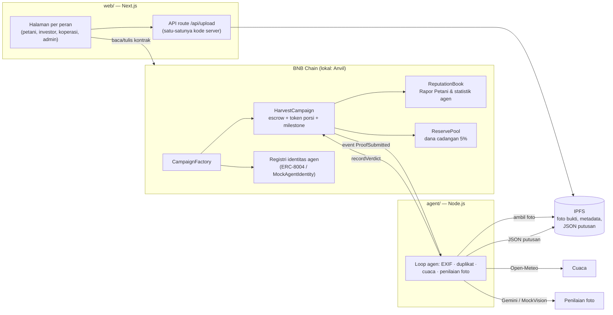

# BagiPanen

**Modal tanam yang adil untuk petani, transparan untuk investor, diverifikasi AI, tercatat onchain.**

BagiPanen adalah platform pendanaan modal tanam untuk petani Indonesia di BNB Chain. Investor mendanai satu musim tanam dengan stablecoin. Dana cair bertahap setelah bukti lapangan diverifikasi **agen AI dan koperasi**, lalu hasil panen dibagi otomatis oleh smart contract.

> Dibuat untuk Indonesia Web3 Hackathon 2026 — track Finance & Commerce (RWA + stablecoin), AI Agents, dan Consumer Apps.
> Status: berjalan penuh di chain lokal (Anvil). Deploy ke BSC testnet menyusul di tahap konfigurasi.

## Masalah & solusi

Petani kecil sulit mendapat kredit bank karena tidak punya riwayat kredit, sehingga modal tanam datang dari tengkulak lewat sistem *ijon*: panen dibeli murah sebelum waktunya.

BagiPanen menguncinya di smart contract:

- **Dua kunci pencairan.** Dana tiap tahap (Tanam 40%, Tumbuh 35%, Pra-panen 25%) hanya cair jika agen AI **dan** koperasi sama-sama menyetujui foto bukti lapangan.
- **Agen AI dengan identitas onchain.** Agen verifikator punya identitas berbasis ERC-721 (registri identitas ERC-8004; di chain lokal memakai fallback `MockAgentIdentity`) dan rekam jejak putusan yang publik.
- **Rapor Petani.** Setiap musim tercatat onchain sebagai riwayat kredit alternatif bagi petani yang tidak tercatat di SLIK OJK.
- **Bagi hasil otomatis.** Modal kembali ke investor dulu, lalu keuntungan dibagi **55% petani, 40% investor, 5% dana cadangan**. Admin tidak bisa menarik dana escrow.

Contoh dari data demo — modal 1.000 USDT, hasil penjualan 1.650 USDT:

| Pos | USDT |
| --- | --- |
| Dana cair ke petani (400 + 350 + 250) | 1.000 |
| Keuntungan (1.650 − 1.000) | 650 |
| Bagian petani (55%) | 357,5 |
| Dana cadangan (5%) | 32,5 |
| Pool investor (modal + 40%) | 1.260 → Rina 630, Budi 378, Sari 252 (**imbal hasil 26%**) |

## Arsitektur

Tidak ada server maupun database. Smart contract menyimpan data dan dana, IPFS menyimpan file, dan agen AI adalah satu-satunya proses off-chain yang aktif.



Agen menilai setiap bukti dalam 7 langkah:

1. ambil konteks dari kontrak;
2. unduh foto dan hitung SHA-256;
3. cek duplikat;
4. cek EXIF: GPS ≤ 2 km dari lahan, tanggal ≤ 7 hari;
5. ambil cuaca 14 hari dari Open-Meteo;
6. nilai foto dengan AI;
7. unggah JSON putusan dan panggil `recordVerdict`.

Foto hanya disetujui jika berupa foto lahan, komoditas dan fasenya cocok, keyakinan AI ≥ 0,70, EXIF tidak bertentangan, dan foto bukan duplikat.

## Smart contract

Solidity ^0.8.24, Foundry, OpenZeppelin v5. Semua kontrak ada di [contracts/src/](contracts/src/).

| Kontrak | Fungsi |
| --- | --- |
| `CampaignFactory` | Registri koperasi & petani, pembuat kampanye, persetujuan admin, konfigurasi agen |
| `HarvestCampaign` | Satu per kampanye: escrow mUSDT, token porsi 1:1 (tidak bisa dipindahtangankan), milestone dua kunci, sengketa, gagal panen, gagal bayar, bagi hasil, klaim kumulatif |
| `CampaignDeployer` | Memuat bytecode kampanye agar factory tetap di bawah batas ukuran kontrak (EIP-170) |
| `ReservePool` | Dana cadangan 5%; kompensasi hanya bisa dikirim ke kampanye resmi |
| `ReputationBook` | Rapor Petani dan statistik putusan agen, hanya bisa ditulis oleh kampanye resmi |
| `MockUSDT` | Stablecoin demo (18 desimal, `mint` terbuka maks 10.000 per panggilan) |
| `MockAgentIdentity` | Fallback registri identitas agen (ERC-721 minimal) |

### Alamat kontrak

| Kontrak | Anvil (lokal, chain 31337) | BSC testnet (chain 97) |
| --- | --- | --- |
| CampaignFactory | `0x9fE46736679d2D9a65F0992F2272dE9f3c7fa6e0` | _menyusul_ |
| MockUSDT | `0x5FbDB2315678afecb367f032d93F642f64180aa3` | _menyusul_ |
| MockAgentIdentity | `0xe7f1725E7734CE288F8367e1Bb143E90bb3F0512` | _menyusul_ |
| ReputationBook | `0xCf7Ed3AccA5a467e9e704C703E8D87F634fB0Fc9` | _menyusul_ |
| ReservePool | `0xDc64a140Aa3E981100a9becA4E685f962f0cF6C9` | _menyusul_ |

Alamat Anvil selalu sama setiap `npm run dev:chain`, karena deploy dari akun bawaan Anvil pada nonce yang sama. Daftar lengkapnya ada di [deployments/anvil.json](deployments/anvil.json).

## Menjalankan di lokal

Mode lokal tidak butuh akun, API key, maupun MetaMask. Chain, penyimpanan file, dan penilai foto semuanya berjalan di laptop.

**Prasyarat:** Node.js 20+, Git, [Foundry](https://book.getfoundry.sh/getting-started/installation) (`forge`, `anvil`, `cast`).

```bash
git clone <repo> bagipanen && cd bagipanen
git submodule update --init --depth 1     # library Foundry (forge-std, OpenZeppelin)
(cd web && npm install) && (cd agent && npm install)
```

Jalankan di tiga terminal:

```bash
npm run dev:chain   # 1. Anvil + deploy + data demo + daftarkan agen AI (biarkan jalan)
npm run dev:web     # 2. web di http://localhost:3000
npm run dev:agent   # 3. agen AI (log: [BUKTI] → [AI] → [PUTUSAN])
```

Pilih peran lewat **pemilih akun demo** di header. Setiap akun adalah akun bawaan Anvil: Admin, Koperasi (Koperasi Tani Makmur, Garut), Petani (Pak Darto), serta investor Rina, Budi, dan Sari (masing-masing 5.000 mUSDT). Tombol **Minta mUSDT demo** mengisi 1.000 mUSDT tambahan.

### Skenario demo

1. **Petani → Ajukan.** Klik *Isi contoh data demo*, lalu pilih foto lahan. Koordinat terisi otomatis dari GPS foto. Klik *Ajukan kampanye*.
2. **Admin → Admin.** Klik *Setujui kampanye*; tenggat pendanaan 10 menit dimulai.
3. **Rina, Budi, Sari** buka halaman kampanye dan danai 500, 300, dan 200. Setiap pendanaan melewati dua langkah: *Setujui mUSDT*, lalu *Danai*. Target tercapai dan status berubah menjadi **Berjalan**.
4. **Petani** unggah bukti Tanam dengan foto yang nama filenya mengandung `salah`. Agen menolak dalam ±10 detik, beserta alasannya. **Koperasi → Koperasi** memutuskan di antrean. Petani lalu unggah ulang foto yang benar: agen dan koperasi setuju, dan 400 USDT cair.
5. Ulangi untuk **Tumbuh** (350) dan **Pra-panen** (250).
6. **Petani** setor hasil panen 1.650 beserta foto nota (*Unggah nota → Setujui mUSDT → Setor*). Bagian petani 357,5 dan dana cadangan 32,5 langsung terkirim.
7. **Rina, Budi, Sari** klaim 630, 378, dan 252. Lihat juga **Rapor Petani** (klik nama petani) dan **Agen AI**.

Di mode lokal, penilai foto adalah `MockVision`: ia menyetujui foto, kecuali nama filenya mengandung `salah` atau `tolak`. Pemeriksaan EXIF, duplikat, dan cuaca tetap berjalan sungguhan. Foto yang dikirim lewat WhatsApp kehilangan EXIF; unggah langsung dari galeri kamera.

Menjalankan ulang `npm run dev:chain` memulai chain dari nol, dan agen mendeteksinya otomatis.

## Test

```bash
npm run test:contracts   # 90 test Foundry (cakupan 100% baris/cabang/fungsi), termasuk fuzz pembulatan
npm run test:agent       # 40 unit test agen (aturan putusan, EXIF, MockVision, cuaca, duplikat)
(cd web && npm run lint && npm run build)
```

Test Foundry mencakup semua skenario wajib PRD:

- happy path dengan angka di atas;
- pendanaan gagal → refund;
- ditolak AI → unggah ulang;
- sengketa;
- panen di bawah modal;
- gagal panen + kompensasi kumulatif;
- gagal bayar → petani diblokir;
- kontrol akses;
- fuzz pembulatan.

## Struktur repo

```text
contracts/   Foundry: src/ (kontrak), test/, script/ (Deploy, Seed)
web/         Next.js App Router + Tailwind + wagmi v2 + RainbowKit
agent/       Agen AI Node.js (viem, exifr, @google/genai)
deployments/ Alamat kontrak hasil deploy (anvil.json, bscTestnet.json)
scripts/     dev-chain.mjs (satu perintah chain lokal), sync.mjs (salin ABI & alamat)
docs/        PRD, catatan keputusan, hasil uji acceptance
```

## Mode testnet

Kode yang sama berjalan di BSC testnet cukup dengan mengganti `.env` ke `APP_MODE=testnet`. Adapter yang dipakai otomatis beralih:

| Komponen | Mode lokal | Mode testnet |
| --- | --- | --- |
| Jaringan | Anvil | BSC testnet |
| Wallet | Akun demo | MetaMask |
| Penyimpanan | Folder lokal | IPFS via Pinata |
| Penilai foto | MockVision | Gemini |

Daftar variabelnya ada di [.env.example](.env.example). Panduan deploy dan alamat BSC testnet ditambahkan setelah tahap konfigurasi.

## Di luar lingkup MVP

Login sosial & gasless, BNB Greenfield, pasar sekunder token porsi, pembayaran x402, notifikasi WhatsApp/Telegram, mainnet, multisig admin, dan reputasi di Reputation Registry ERC-8004. Roadmap lengkapnya ada di [docs/PRD.md](docs/PRD.md).
